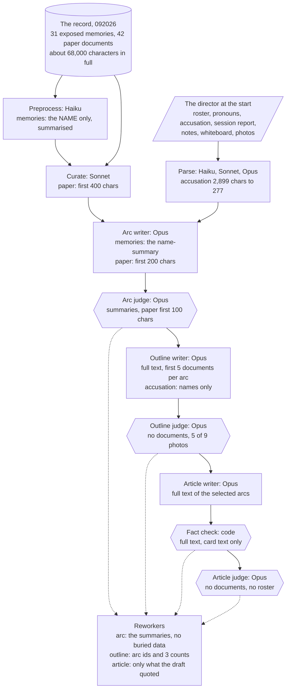

# Information architecture: how the pipeline turns its inputs into an article

Written 2026-09-24 at `main` `b3d1a1a`, before any phase 2 brief. The director asked two questions. Is there a complete picture of how information moves through the system, checked against established practice? And how do the different kinds of input, prompting and data come together to reach this system's particular objectives? This document answers both. It maps every model call and check by what it sees, lists the objectives, follows each objective through the inputs, instructions and judges that serve it, compares the result with published guidance and research, and ends with the decisions it raises.

**Sources.** Nine surveys and research files, kept locally (the repo is public and they quote session data) under `.superpowers/sdd/2026-09-24-phase-2/surveys/` and `.superpowers/analysis/2026-09-24-information-architecture/`. The load-bearing claims below were checked against the code and the call logs of sessions 091826 and 092026 before they were written here. Line numbers are at `b3d1a1a`.

**Words.** The vocabulary is `CONTEXT.md`'s. Two tags describe every input:
- **Kind:** `record` (the session's game documents and transactions), `director` (anything the director supplies), `canon` (fixed game facts: characters, NPCs, theme settings), `craft` (instructions: prompt files, inline prompt text, schema descriptions, templates), `derived` (what an earlier call or code produced).
- **Fidelity:** `full` (the source's own words, whole), `excerpt` (verbatim but cut), `summary` (a paraphrase), `reference` (an id or a name), `count`, `absent`.

## 1. What the system must achieve

The objectives come from the design, the glossary, the craft files, the judges' criteria, the session readout and the director's own editorial notes. Merged, they make 105 testable properties in eight groups.

| Group | Objectives | Examples |
|---|---|---|
| A. Accuracy against the record | 16 | every claim supported; cards verbatim; the accusation reported as recorded; money figures right |
| B. Evidence boundaries | 11 | no buried content or owner; exposure anonymous by default; money flows to the burier |
| P. People | 11 | every roster member seen through something they did; pronouns from the roster only |
| T. Thesis and structure | 16 | one thesis, the gap between the room's verdict and the record; sections serve it; arcs intercut |
| V. Voice and reporting mode | 13 | the mode holds everywhere; remote absence shown through attribution, not announced |
| C. Journalism craft | 14 | headline and deck do journalism; no em-dashes; the writer is asked only for what prints |
| Ph. Photos | 6 | captions keep the director's subject and action; the director's description reaches the writer |
| H. The director's authority and steering | 18 | words flow; a rework sees what its writer saw; a trace; the evaluation reflects the director's judgement |

Where they live today:

| Status | Objectives |
|---|---|
| Told to a writer and verified by a blocking check, an evaluation criterion or a mechanism | about 33 |
| Told to a writer and verified by nothing | 31 |
| Verified only by an advisory that blocks nothing | 8 |
| Neither told nor verified | 28, almost all stated only by the director |
| Console features not built yet | 5 |

The sources also disagree with each other: 37 conflicts between documents (for example three versions of when to name who exposed a memory), and 25 pairs of instructions that tell the same model call different things (section 3.4).

## 2. The map

Every model call is built from the five kinds of input. The diagram follows the record, the input the whole article rests on, through the chain.

### 2.1 The record

| Call | What it sees of a memory | What it sees of a paper document |
|---|---|---|
| Preprocessor (Haiku) | its name only; the model's summary of that name becomes the memory's "summary" for curation, the arc writer and the arc judge | name and full text; its summary is then thrown away |
| Character-data extraction (Haiku) | first 200 characters of the first 30 exposed | first 1,500 characters of every fetched document, ignoring the director's selection |
| Curation scoring (Sonnet) | 60 characters of the name-summary | first 400 characters |
| Arc writer (Opus) | the name-summary | first 200 characters |
| Arc judge (Opus) | the name-summary | first 100 characters |
| Arc reworker (Opus) | the same summaries; none of the buried transactions, whiteboard or character context its writer had | the same |
| Outline writer (Opus) | full text, first five documents per arc | full text, first five per arc |
| Outline judge (Opus) | nothing | nothing |
| Outline reworker (Opus) | nothing (arc ids and three counts) | nothing |
| Article writer (Opus) | full text, every document in the selected arcs, no owner | the same |
| Fact check (code) | full text | full text |
| Article judge (Opus) | nothing | nothing |
| Article reworker (Opus) | only what the previous draft's cards quoted | the same |

The fidelity runs backwards. The stages that decide what the story is (arcs, outline) and the three judges see the least; only the article writer sees the record whole; the reworkers see least of all. On 092026, 12 of the 37 documents the article writer used never reached the outline writer.

One document shows the whole chain. The paternity test in 092026 is 2,775 characters. The arc writer's 200 characters stop before the result, which reached the arc writer only through Haiku's character summary, labelled "use for factual accuracy". The article writer got the full text, re-punctuated it and gave the owner as a different character than the record's. The fact check failed the card twice (inline and sidebar), the reworker could not see the document and turned the card into a caption, and the director restored it by hand.

The size of the record matters for what follows. The whole usable record of 092026 is about 68,000 characters (31 exposed memories, 14,602; all 42 paper documents, 53,459), roughly 17,000 tokens. The article writer's prompt is 211,000 characters, of which the evidence packages take about 43,000 and the instructions about 141,000.

### 2.2 The director's inputs

| Input | What later calls see | Where it stops |
|---|---|---|
| Roster | names everywhere; the article writer's roster block lists all 21 memory owners instead, and the nine players appear in its session facts | article writer, fact check |
| Pronouns | the article writer only. Characters missing from the roster default to they/them, so the victim is listed as both they/them and he/him in the same block | article writer |
| Accusation (2,899 characters on 092026) | one Haiku call sees it whole. The arc writer sees 277 characters of notes plus accused and charge. The outline and article writers see `ACCUSATION: <accused names>`, no charge. For an accidental-overdose verdict the parse named the victim as the accused | arc writer (summary); article writer (names) |
| Session report | exposures and burials as ids and amounts; the "Exposed By" column, owners and exposure times are dropped at the parse; the money total shown to writers includes adjustments, the parsed one is never read | outline and article writers, the printed tracker |
| Director notes | full text to the arc, outline and article writers and the arc judge; not to the outline or article reworkers, and not to the outline or article judges. The enricher's character and entity indexes are read by nothing | article writer |
| Input-review corrections | the three parse calls only. The uncorrected sentence stays in the notes that every writer reads, next to the corrected quote | parse |
| Whiteboard | the arc writer only | arc writer |
| Photo descriptions | stop at the photo parser. Writers get `filename: names`; the outline writer gets Haiku's generic description from before the director's identification | photo parser |
| Arc selection, outline guidance | reach the outline and article writers and reworkers | article reworker |
| Notes (approval and rejection) | standing notes in every outline and article writer and reworker; not in the arc prompts, so a second arc send-back loses the first note; no judge sees them | article reworker |
| Hand edits | kept exactly, reported kept or changed | print |
| Reporting mode | eight system prompts, the article judge, the fact check | article judge |

### 2.3 Canon

The canonical character list is every owner of a fetched memory (21 on 092026), not the roster. The article writer receives it under the heading "CANONICAL CHARACTER ROSTER" with invented pronouns, while its session facts say only the nine players were present. NPC facts are written in several places that disagree: a hard-coded list in the character extractor, the theme settings ("central to every arc") and the arc judge ("should appear in most arcs").

### 2.4 Craft

- Eleven prompt files per theme, plus inline instruction blocks in at least six code files. The arc calls load no prompt file at all; they restate the rules in their own words, and one of those restatements ("name who exposed each memory") contradicts the files.
- 25 conflicting instruction pairs inside single calls, confirmed in the 092026 prompts. Among them: the victim's pronouns (above); three versions of the exposer rule in one prompt; "NO countable memories" beside the example "Two memories buried."; quote attribution "REQUIRED" and "omitted"; "the game runs 7-9 PM" against "the investigation was this morning"; sidebar text "VERBATIM full text" against "NOT verbatim"; presence lines ("I watched", "I saw", "Nova was there") under a remote mode block; the arc rework's "you MAY replace entire arcs" against "do NOT regenerate from scratch".
- Rules sit next to examples that break them in five craft files. Instructions name data the call does not have (`temporalContext`, the value rating) and sections it does not have (`<SESSION_FACTS>` in the reworks).
- About a dozen fields are asked for that never print: pull quotes, top-level photos, sidebar `content` and `owner`, byline location and date; the detective theme prints no headline, byline or hero at all.
- The detective craft has never run live and contradicts itself (HTML against JSON, a third-person voice with first-person samples).

### 2.5 Derived data

- Derived data is labelled as fact. Haiku's summaries of memory names reach the arc writer as the memories themselves. Character data drawn from cut excerpts reaches the arc and article writers as "use for factual accuracy". Contradiction notes reach them as "verified to respect evidence boundaries". Haiku's photo descriptions reach the outline judge as "ground truth".
- Some fields are produced and never read: the parse's session date and money total, player-focus fields, the enricher's indexes. Others are read and never written: the whiteboard analysis at the context stop, the pre-curation summary, the accusation context used by curation, and the interweaving plan the outline judge asks for, which is always null.
- Any arc rework drops the interweaving plan the outline writer relies on.

### 2.6 The judges

| Judge | Sees | Decides | Record |
|---|---|---|---|
| Arc structure check (code) | arcs, roster, canonical names, valid ids | roster coverage and an accusation arc (structural); silently rewrites arcs | none needed |
| Arc evaluation (Opus) | arcs, roster, the director's notes, summarised focus, name-summaries | 5 criteria in one call | summaries only |
| Outline evaluation (Opus) | outline, arc ids, 5 of 9 photos, a null interweaving plan | 12 criteria; "required sections" is structural | none |
| Fact check (code) | the bundle, the full record, roster, photo files, mode | card fidelity, roster coverage, photo files, 7 presence and vote phrases (structural); NPC pronouns and leaked examples (advisory) | full, but reads sidebar text that never prints |
| Article evaluation (Opus) | the bundle and the outline, the mode | 8 criteria in one call, including "are all roster members mentioned?" without a roster | none; it does not see the fact check's result either |

All eight model evaluations in the two sessions returned ready, with no structural issue (arcs 0.99 and 0.98, outlines 0.93 and 0.92, articles 0.94 to 0.98). On 091826 the director then sent the article back twice and made 21 hand changes, 9 of them for accuracy. On 092026 the article judge cited "I was not in that room" as evidence of good voice and gave reporting mode full marks; the design treats that sentence as a defect. At least eight writing rules have no judge at all, among them countable memories, exposer naming, buried ownership, the party and morning split, non-roster agency, invented surnames, verbatim quote blocks, and cards in the lede.

## 3. How the inputs come together, objective by objective

For each group: what the objective needs, what arrives, which instructions and judges serve it, and where it breaks.

**A. Accuracy against the record.**
- Needs the record in full wherever a claim is made, the director's raw words, and a check of prose claims.
- Gets full text at the article writer only; the story is decided from name-summaries and 200-character excerpts. The accusation's charge never reaches the article writer. The clock-time and "canon truth" instructions conflict.
- Checked for card text only. Nothing reads prose claims, and the evaluation has no record.
- It breaks at the article stop: 9 of 21 hand changes on 091826; on 092026 "the room accused Marcus of his own murder" for an overdose verdict, the direction of a character's loss, and a document's owner, all under a 0.98.

**B. Evidence boundaries.**
- Needs every document to carry its layer where it appears, and buried data to arrive as metadata only.
- Gets the layer implied by which section a document sits in. Buried memories' names, which carry owner and gist, go into the Haiku preprocessor. The rule lives in one craft file while five others model breaking it.
- Checked by nothing.
- Recent sessions show no buried-content edits, but the account-name-as-actor error was a measured class before September, and the contradiction node still feeds writers "used their own name for a burial account" as boundary-safe.

**P. People.**
- Needs the roster with pronouns wherever people are written about, NPC canon, and each document's owner.
- Gets pronouns at the article writer only, 21 canonical names presented as the roster with invented pronouns, and no owner on any document the article writer sees.
- Checked for roster coverage (structural, though it counts text that never prints) and NPC pronouns (advisory). Roster pronouns and document owners are checked by nothing.
- It breaks at the article stop: a caption pronoun, a card owner and the guest byline's tie to a player's role fixed by hand on 092026.

**T. Thesis and structure.**
- Needs, at the stage that decides structure, the room's verdict in full (accusation, whiteboard, deliberation) and the record's pattern, plus the director's direction before the article is written.
- Gets summaries at the arc stage; names only for the accusation and five documents per arc at the outline stage. The thesis is proposed at the outline stop. The instructions say both "thesis-driven sections" and "fixed required sections".
- Judged by a structural criterion that requires fixed sections, which opposes the objective, and no thesis criterion.
- Structural trouble is typical by the director's account. It cost two send-backs on 091826, each a whole-article rework.

**V. Voice and reporting mode.**
- Needs one statement of where the reporter was, and every other line deferring to it, in every writer and judge.
- Gets the mode block in eight system prompts and about twenty other presence or absence lines across the craft files and the builders. The judge rewards announcing absence.
- Checked by seven phrases in code and one evaluation criterion.
- It breaks in print: five announcements of absence on 092026, and presence claims on 091826 before phase 1.

**C. Journalism craft.**
- Needs rules that agree, each with its reason, and requests only for what prints.
- Gets 25 in-call conflicts. The outline stage does not load the headline rules and has no headline field. About a dozen requested fields never print.
- Judged by one evaluation criterion for anti-patterns, which names three of the rules.
- It breaks in several ways: sidebar text flagged, then cards stripped; pull quotes written and never printed on 091826; headline and deck rewritten by hand in both sessions.

**Ph. Photos.**
- Needs the director's per-photo description at the writers, as the authority.
- Gets filenames and names. The outline judge sees 5 of 9 photos, and its false note that three photos had "no analyses" travelled to the article writer.
- Checked for filenames only.
- On 091826, 0 of 6 captions matched the director's descriptions. On 092026, two captions came from other material, and one was fixed by hand.

**H. The director's authority and steering.**
- Needs every director word to reach the calls it concerns, labelled with its authority, surviving corrections and reworks, with a trace of what the machine did.
- Gets notes at the outline and article stops (phase 1), but not in the arc prompts. Corrections reach the parse only. No judge sees a note. The reworkers are blind. The reworks carry fixed "preserve" text. There is no trace.
- It breaks at every kind of rework: on 092026 four correct cards stripped; on 091826 "rethink the whole thing" answered with a relabel.

## 4. Against established practice

The research files cite 19 engineering patterns and 18 research findings. The ones that bear on the map:

| Practice (source) | What the pipeline does | Verdict |
|---|---|---|
| Chain fixed steps with programmatic gates between them (Anthropic, "Building effective agents"; STORM) | a chain with gates, but the gates judge without the grounds the step used | partly |
| Don't compress what a later decision depends on; a corpus under about 200,000 tokens can go into the prompt whole (Anthropic context engineering and contextual retrieval; Li et al. 2024) | the stages that decide the story see the most compressed view of a 17,000-token record | against |
| What the planning stage sees changes the plan: outlines built after reading the sources covered more (STORM), compressing sources cut citation precision by about 11 points (ALCE) | the planner reads summaries and the writer reads full text | against |
| Chained summaries drop entities, events and causes, and the loss builds with each step (BooookScore; Broken Telephone) | a memory is summarised from its name, then cut to 60 characters, then used to decide arcs | against |
| Keep context small and high-signal; quality falls with length on every model tested, 2025 Claude models included (Chroma Context Rot; Lost in the Middle; Levy et al.) | about 141,000 characters of instructions around 43,000 of record in the article writer | against, and the excess is instructions, not record |
| Fewer rules, each with its reason, stated as what to do; compliance falls as rules multiply and the usual failure is omission (Anthropic prompting guide; IFScale, 20 models including Claude Opus 4) | about 141,000 characters of instructions from eleven files and inline code, 25 in-call conflicts, heavy capitals, examples that break rules | against |
| Put long documents first and the question last for Claude; vendors disagree (Anthropic; OpenAI GPT-4.1 guide; Gupta et al. 2024) | rules placed last; never measured on this pipeline | untested |
| Ground in exact quotes, and let the system extract quotes instead of the model retyping them (Anthropic hallucination guide and Citations; Attribute First, then Generate) | the writer types card text inside JSON; phase 4 moves card text to the server | against now, planned |
| Verify after writing, claim by claim, against the sources (FActScore; MiniCheck; Anthropic's "retract what has no quote") | card text only; no check of prose claims | against; the claim check is planned for phase 6 |
| A revision loop needs criteria and feedback grounded in outside evidence; self-correction without it is unreliable, and a reviser without evidence can only rephrase or delete (Huang et al.; CRITIC; RARR; Self-Refine) | Opus judges without the record; reworkers without the documents; 092026 deleted four correct cards | against |
| A worker needs at least the writer's inputs and a precise brief (Anthropic multi-agent research system) | violated at all three reworkers | against |
| Judges: one dimension each, calibrated against the expert's verdicts, watched for leniency and self-preference; judges do far better with the reference in hand (Anthropic evals guide; Hamel Husain; Zheng et al.; Prometheus; FACTS) | one Opus call scores 5 to 12 criteria, Opus judging Opus, no record, never compared with the director's verdicts; 8 of 8 passed | against |
| Layer graders: code first, model second, human last (Anthropic evals guide) | code checks cards, roster and seven phrases; most of the rest falls to the director | partly |
| Criteria emerge from review; turn the expert's edits into reusable guidance (EvalGen; PRELUDE; LAMP) | inside the pipeline, the director's edits and send-back reasons shape nothing past the current session | against |
| Lower the cost of verification for the human; fluent drafts anchor reviewers (Microsoft reliance synthesis; Beck et al. 2025; AP via Poynter) | the stops show neither the source beside a claim nor what the machine changed | against; the trace is planned |
| Write down what each handoff must pass; multi-stage systems fail at handoffs and at verification (MAST, 1,600 traces) | fields produced and never read, read and never written, the interweaving plan lost, previous versions discarded | against |
| Label every document with its source and metadata (Anthropic long-context guide; OpenAI) | documents render as `id (type): "text"`, with no owner and no layer | against |
| A narrator's knowledge boundary is enforced best by a step that reasons about it claim by claim; more context without the boundary made role-play worse (TimeChara) | the reporting mode and the buried layer are enforced by rule blocks inside a long prompt | nearest analogue only |

Two properties of this system have no published guidance: the three disclosure layers, and the reporting mode. Their design has to reason from the nearest analogues above.

Sources (all read on 2026-09-24): Anthropic, [Building effective agents](https://www.anthropic.com/engineering/building-effective-agents), [Effective context engineering](https://www.anthropic.com/engineering/effective-context-engineering-for-ai-agents), [multi-agent research system](https://www.anthropic.com/engineering/multi-agent-research-system), [Demystifying evals](https://www.anthropic.com/engineering/demystifying-evals-for-ai-agents), [Contextual retrieval](https://www.anthropic.com/engineering/contextual-retrieval), [Reduce hallucinations](https://platform.claude.com/docs/en/test-and-evaluate/strengthen-guardrails/reduce-hallucinations), [Citations](https://platform.claude.com/docs/en/build-with-claude/citations); OpenAI, [GPT-4.1 prompting guide](https://developers.openai.com/cookbook/examples/gpt4-1_prompting_guide); Chroma, [Context Rot](https://www.trychroma.com/research/context-rot); Hamel Husain, [Using LLM-as-a-Judge](https://hamel.dev/blog/posts/llm-judge/); Shao et al. 2024, [STORM](https://arxiv.org/abs/2402.14207); Gao et al. 2023, [ALCE](https://arxiv.org/abs/2305.14627); Min et al. 2023, [FActScore](https://arxiv.org/abs/2305.14251); Huang et al. 2024, [LLMs cannot self-correct reasoning yet](https://arxiv.org/abs/2310.01798); Gou et al. 2024, [CRITIC](https://arxiv.org/abs/2305.11738); Madaan et al. 2023, [Self-Refine](https://arxiv.org/abs/2303.17651); Zheng et al. 2023, [Judging LLM-as-a-Judge](https://arxiv.org/abs/2306.05685); Jaroslawicz et al. 2025, [IFScale](https://arxiv.org/abs/2507.11538); Liu et al. 2024, [Lost in the Middle](https://arxiv.org/abs/2307.03172); Cemri et al. 2025, [MAST](https://arxiv.org/abs/2503.13657); Ahn et al. 2024, [TimeChara](https://arxiv.org/abs/2405.18027); Microsoft, [Appropriate reliance on GenAI](https://www.microsoft.com/en-us/research/publication/appropriate-reliance-on-generative-ai-research-synthesis/). Many figures were read from abstracts or through a summarising fetch; the local research files mark which, and a figure is checked against its paper before anything is built on it.

## 5. Diagnosis: six root causes

The findings above are not independent. Most come from six design facts.

1. **There is no single way to reach the record.** Each call gets a hand-built copy of the documents, cut to a different length (a name, 60, 100, 200, 400 or 1,500 characters, five per arc, or whole), with no uniform label for id, kind, owner and layer. The stages that decide the story and the judges get the least. Q1 in the roadmap review was one instance of this.
2. **The director's words are converted once, and the conversion replaces them.** The accusation, the photo descriptions, the session report's columns and the input corrections reach later calls only through a parse. The raw text travels only where some builder happened to include it.
3. **Derived data is presented as fact.** Summaries of names, excerpts cut mid-sentence and heuristic notes reach writers and judges under labels such as "use for factual accuracy", "verified" and "ground truth".
4. **The craft layer has no single source of truth.** Rules are spread over eleven files and inline code in six places, restated in different words (the arc calls load no file at all), with conflicts inside single prompts, examples that break their own rules, and instructions for data and fields that do not exist.
5. **The judges are ungrounded and uncalibrated.** The model judges see no record, roster or notes, score many criteria in one call, have never failed a stage, and have never been compared with the director's verdicts. The code checks read text that never prints.
6. **Handoffs have no contracts.** Nothing states what each stage must pass on, so outputs are dropped (the interweaving plan, previous versions, the reasons for a rework) and inputs are read that no stage writes.

| Root cause | Objective groups it hurts most | Practice it departs from |
|---|---|---|
| 1. No single way to reach the record | A, T, P, H (H7) | don't compress what later decisions depend on; the planner's view; reworker at least the writer's inputs; grounded judges |
| 2. The director's words converted and replaced | A, T, Ph, H | edits and corrections as reusable guidance; human authority |
| 3. Derived data presented as fact | A, P, Ph | label sources; ground in quotes |
| 4. No single source of truth for craft | B, V, C, T | fewer rules with reasons; one statement per rule |
| 5. Ungrounded, uncalibrated judges | all, through false confidence | judges with the reference, calibrated to the expert; layered graders |
| 6. Handoffs without contracts | H, T | stage contracts; verification at handoffs |

## 6. Decisions this raises

The roadmap review left three questions open (Q1 to Q3). In the light of the map they change shape, and one more joins them. Each carries a recommendation.

**Q1. What each call sees of the record.** The original question was whether to match each reworker to its writer. The map shows the writers themselves see too little, and the record is small.
- (a) Match each reworker to its writer only, as phase 2 was scoped.
- (b) One record view for every call that decides, writes, reworks or judges the story: every usable document in full, each wrapped with the same label (id, kind, name, owner, layer), plus the buried layer as transactions only. That is at most about 17,000 tokens for 092026. The Haiku name-only summary step would feed from full text or go.
- (c) Per-section slices, as STORM does, later.

Recommended: (b). The whole record is smaller than the instructions the article writer already carries, and published results point the same way: the planner's view shapes the plan, chains of summaries lose detail, and a reviser or judge without the evidence can only guess. The length risk lies in the 141,000 characters of instructions, which Q3 addresses. (b) contains (a).

**Q2. The director's words.**
- (a) Keep the current conversions.
- (b) Keep the director's raw text as part of the record and give it, next to its parse and never replaced by it, to every call that writes or judges the story. That covers the full accusation, each photo description word for word, and corrections stored and applied to the text the writers read. Standing notes go into the arc prompts. Nothing a stage produces is dropped at a handoff (the interweaving plan first).

Recommended: (b). It also absorbs the earlier Q2 (the two arc-stop gaps). One sub-question needs your intent: the session report's "Exposed By" column is dropped at the parse. Is that source protection, or a loss?

**Q3. The craft layer.**
- (a) Fix only the reporting-mode lines, the earlier Q3.
- (b) One consolidated rule set with a reason for each rule, loaded by every writer and judge, the arc calls included. You rule on each conflict first: 37 between documents and 25 inside single calls, most of them editorial (who may be named as an exposer, whether memories may be counted, clock times, a fixed or a thesis-driven section list).
- (c) The mode lines now, because they caused the 092026 announcements, then (b).

Recommended: (c). Your rulings are editorial decisions only you can make, so they would come from a grill session. That session can run while phase 2 is being built, so the consolidation lands before the story map is written on top of it.

**Q4. The judges.**
- (a) Leave them until the evaluation phase.
- (b) Now: give them the same record view as Q1(b), the roster, your notes and the fact check's result. Show their scores at the stops as uncalibrated. Calibrate them against your verdicts on 091826 and 092026 in the evaluation phase.

Recommended: (b). A 0.98 that has never failed and has rewarded what you remove is worse than no score, and grounding them costs little once Q1(b) exists.

The order of the roadmap depends on these answers, so it is the next round's question. One point already stands. The SDK and Opus 5.5 slice is independent of all four, and stays first.

**Decided by the director on 2026-09-25.**
- Q1: (b). One record view, every usable document in full with the same label, for every call that decides, writes, reworks or judges the story.
- Q2: (b). The director's raw text stays part of the record beside its parse. Dropping the session report's "Exposed By" column was a loss, so it travels too. When a writer may name an exposer stays governed by the exposer rule, which is one of the Q3 rulings.
- Q3: (c). The reporting-mode lines are fixed now; the rule set is consolidated after the director rules on the conflicts in a grill session.
- Q4: (b). The judges get the record view, the roster, the director's notes and the fact check's result now; their scores show as uncalibrated at the stops until they are calibrated against the director's verdicts.

## 7. Open questions the map found, for later

These do not block the decisions above. Each has a home once the order is set.
- Should a verdict with no culprit (accidental overdose) have a shape in the accusation schema, instead of naming the victim?
- Which money total is the figure of record: the sum with adjustments, or the sales total?
- A whiteboard photo inside the photo folder is never parsed as a whiteboard.
- The image prompts always use the journalist files, whatever the theme.
- A rescue the curator did not flag as rescuable is refused silently.
- Buried memory ids reach the enricher and could reach writers through a transaction link.
- Should the writer stop being asked for fields that never print, or should the templates print them? The answer also decides what the roster check counts.
- The detective theme needs its own review before it runs live.
