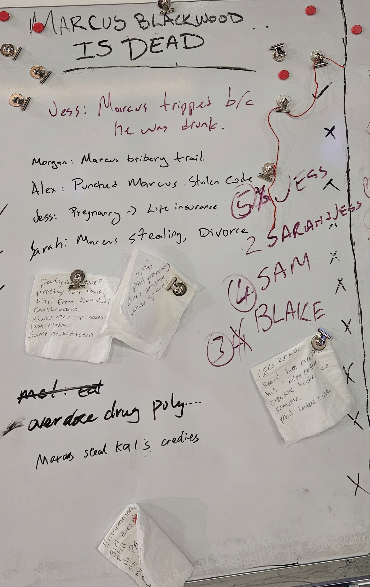

# Pass 1 Edit Plan — Fact-Correction — Session 052926

> Translates `report-052926-findings.md` into concrete prose/markup changes on `outputs/report-052926.html`.
> **Scope: fact-correction only.** No pacing/redundancy/sentence-polish here — that is Pass 2 (copy-edit), run on the corrected article. Proposed replacements aim to be fact-faithful and minimal; Pass 2 may tighten them.
> Severity tags from findings: must-fix (B1, B2), high-value (B3, B4), polish (B5–B9).

---

## 0. Pre-flight (do before HTML edits)

- **Whiteboard photo (for B4):** copy `assets/images/052926/whiteboard.jpg` → `outputs/sessionphotos/052926/whiteboard.jpg` so the `src` resolves from the published file. (All 12 `aln0529` photos already live in `outputs/sessionphotos/052926/`, so photo 2 needs no copy.)
- **No dual-location syncs required:** no evidence-card headlines or financial amounts change in this pass, so the sidebar minis and both financial trackers stay as-is.

---

## 1. THE STORY (`id="the-story"`)

### Edit 1a — [B2] Blake pronoun
**Find:**
> A preliminary count split the room four ways for Jess, four for Sam Thorne, three for **the man who ran the market**.

**Replace:**
> A preliminary count split the room four ways for Jess, four for Sam Thorne, three for **the operator who ran the market**.

### Edit 1b — [B7, optional] Acknowledge the overdose reading
**Find:**
> The strongest theory anyone offered at that point was the gentlest one. Jess herself put it forward. Marcus was drunk, he tripped, he died. It was the kind of explanation that asks nothing of anybody.

**Replace:**
> The strongest theory anyone offered at that point was the gentlest one. Jess herself put it forward. Marcus was drunk, he tripped, he died. It was the kind of explanation that asks nothing of anybody. Others floated a darker version of the same accident — that the experimental drug he had been feeding himself for months had simply caught up with him.

*(Sourced: whiteboard "overdose drug poly…"; jes002/jam002/mar004/nat004. Optional — include only if we want all room theories represented.)*

### Edit 1c — [B4] Place the whiteboard photo
**Insert after the final Story paragraph** ("The room had its name. The record it left behind would take longer to read."), before `</section>`:

```html
<figure class="article-photo article-photo--inline">
  
  <figcaption class="article-photo__caption">The room's whiteboard. Suspects and motives went up in black marker; the vote ran in red. The line that decided it &mdash; &ldquo;Jess: Pregnancy &rarr; Life insurance&rdquo; &mdash; turned a pregnancy into a murder motive.</figcaption>
</figure>
```

*(Caption fact-checked against whiteboard transcription. Avoid em-dashes in final prose if preferred — the `&mdash;` here can be recast as commas/period in Pass 2 per the no-em-dash rule.)*

---

## 2. FOLLOW THE MONEY (`id="follow-the-money"`)

### Edit 2a — [B2] Blake pronoun
**Find:**
> She told **the man running the market** she had nothing to hide.

**Replace:**
> She told **the operator who ran the market** she had nothing to hide.

### Edit 2b — [B3] Tighten the Alex exposure claim to what's observable
**Find:**
> Here is what is observable, and only what is observable: Alex spent that morning **reading her own grievances into the open record, out loud, in front of everyone**. She was never seen at the market table. So I am left with a question I think I am entitled to ask. Who puts their name on hidden money while standing in the light, **broadcasting the very secrets** the money was meant to bury?

**Replace:**
> Here is what is observable, and only what is observable: Alex's own grievances against Marcus sit right there in the open record, and she was never seen at the market table. So I am left with a question I think I am entitled to ask. Who puts their name on hidden money while their own secrets sit out in plain view, the very things that money was meant to bury?

*(Keeps the frame argument — grievances public + absent from Blake's table — but drops the unsupported "out loud, in front of everyone" / "broadcasting," since the public channel was anonymous.)*

### Edit 2c — [B4] Place photo 2 (Alex in the open) to support the frame argument
**Insert before the Alex-account paragraph** ("And then there is the account that bears Alex Reeves's name."):

```html
<figure class="article-photo article-photo--inline">
  
  <figcaption class="article-photo__caption">Alex Reeves reads a recovered document in the open early in the investigation.</figcaption>
</figure>
```

*(Caption from verified character-ids.json. Reinforces "Alex was reading evidence in the open," the observable basis for the frame question.)*

---

## 3. THE PLAYERS (`id="the-players"`)

### Edit 3a — [B5] Drop the unsupported "hours before Marcus died"
**Find:**
> In a bathroom, **hours before Marcus died**, the wife learned the mistress was carrying her husband's child.

**Replace:**
> In a bathroom, **late that last night**, the wife learned the mistress was carrying her husband's child.

### Edit 3b — [B1] Cite the documents behind the Alex / Remi / Mel claims
This is the long paragraph beginning "Two memories describe that bathroom…" and the one beginning "Remi Whitman…". Three document citations to add.

**Alex — find:**
> Alex Reeves read her own grievances into the open and was pressing an IP claim with a legal deadline a week out, the same name that hangs over an account she was never seen near.

**Replace:**
> Alex Reeves was pressing an IP claim against Marcus with a hard deadline a week out: her cease-and-desist letter, sent through Patchwork Law, demanded Marcus be removed as CEO and replaced by a neutral interim chief, and gave the board until the end of the month to comply. Hers is the same name that hangs over an account she was never seen near.

**Remi — find:**
> Remi Whitman, a funding rival who had watched Marcus get money her company deserved, turned proof of his code theft into an alliance with Vic.

**Replace:**
> Remi Whitman had watched Vic pour twenty million dollars into Marcus while freezing out her own revenue-positive company — a snub she put in writing to Marcus directly. By morning she had turned proof of his code theft into an alliance with the very investor who had passed her over.

*(Sourced: Remi's threatening email to Marcus + Remi↔Vic funding email. "Vic" = the investor; keeps Remi she/her.)*

**Mel — find:**
> And Mel Nilsson, Sarah's divorce attorney and one of Marcus's oldest friends, carried a conflict the record makes plain. By the evidence, Mel had once been involved with Marcus himself. That does not make him a suspect. It is the kind of thing a lawyer is supposed to disclose, and the kind of thing that gets lost in a room hunting a single motive.

**Replace:**
> And Mel Nilsson carried a conflict the record makes plain. An email from his own firm, Patchwork Law, shows he had taken Sarah on as a divorce client — noting he had known both Marcus and Sarah for over a decade, and had met Marcus first. What that email leaves out, a thread of old texts with Sam supplies: Mel and Marcus had once been involved. "Wouldn't make that mistake twice," Mel wrote. That does not make him a suspect. It is the kind of thing a lawyer is supposed to disclose, and the kind of thing that gets lost in a room hunting a single motive.

*(Sourced: Mel's law-firm email + Sam↔Mel texts. The direct quote is optional — drop to "Mel and Marcus had once been involved, by his own texts with Sam" if a verbatim private text feels too far.)*

### Edit 3c — [B6, optional] Thin Remi storyline
Edit 3b already adds Remi texture (the funding grievance). If more is wanted, fold in **rem001** (the currently-unused 5★ token): Remi having "watched Marcus slip into a secret room off the party floor" — a small, evocative beat. Low priority.

---

## 4. WHAT'S MISSING (`id="whats-missing"`)

### Edit 4a — [B1] Cite Sam's diary
**Find:**
> The paper trail says who Sam was to Marcus. She made his drugs, she found the paternity test slipped under the warehouse door, she knew him long before the machine.

**Replace:**
> Sam's own diary says who she was to Marcus. She made his drugs — "the shit I'm making for him," she wrote, reproducing a formula he paid her to perfect. She found the paternity test herself, sealed in an envelope someone had slipped under the warehouse door. And she had known him since college, long before the machine.

*(Sourced: Sam's Diary entries 2/18 and 2/20. Direct quote optional.)*

### Edit 4b — [B8] Soften the boundary inference
**Find:**
> What I can tell you is that the people who **paid the most to stay unread** are not the ones who got named.

**Replace:**
> What I can tell you is that the people who **paid the most to keep those memories buried** are not the ones who got named.

---

## 5. HEADER / HEADLINE

### Edit 5a — [B9, director call only] Headline overstatement
"His Widow **Took** the Company" vs. the sourced fact (NeurAI *intends to approach* Sarah for *interim* CEO). The deck and closing already soften this correctly. **Recommend leaving as-is** (headline latitude) unless the director wants precision — e.g., "His Widow Is Being Handed the Company." Flag only; no change unless requested.

---

## 6. Edits NOT to make (guarding against false positives)
- Do **not** change the byline date — "February 22, 2027" is the correct in-world investigation morning (party Feb 21, 2027). See findings §A.
- Do **not** "fix" ale002's "rebuilt his code by sunrise," ril003's "the money is yours," jam002's "lab coat," or sar002's "corporate-shielded" — all verbatim-sourced.
- Do **not** touch the financial tracker, evidence-card content, or any pronoun other than Blake's.

---

## 7. Apply order
1. Pre-flight photo copy (§0).
2. THE STORY: 1a (Blake), 1c (whiteboard), 1b (optional theory line).
3. FOLLOW THE MONEY: 2a (Blake), 2b (Alex tighten), 2c (photo 2).
4. THE PLAYERS: 3a (temporal), 3b (three citations).
5. WHAT'S MISSING: 4a (Sam citation), 4b (soften).
6. Open in browser; confirm both new images load and layout holds.
7. Hand to Pass 2 (copy-edit) on the corrected article — including recasting any `&mdash;` added above to comply with the no-em-dash rule.
